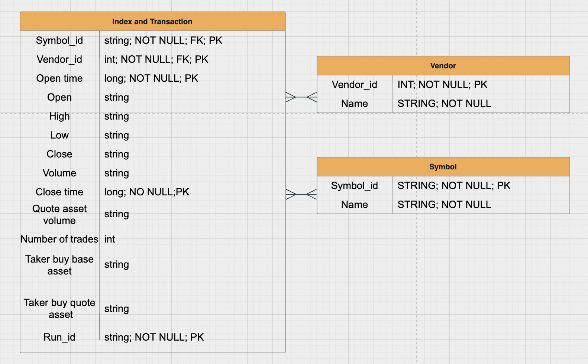
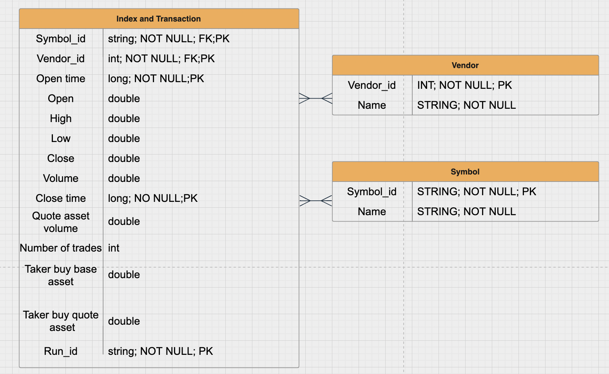
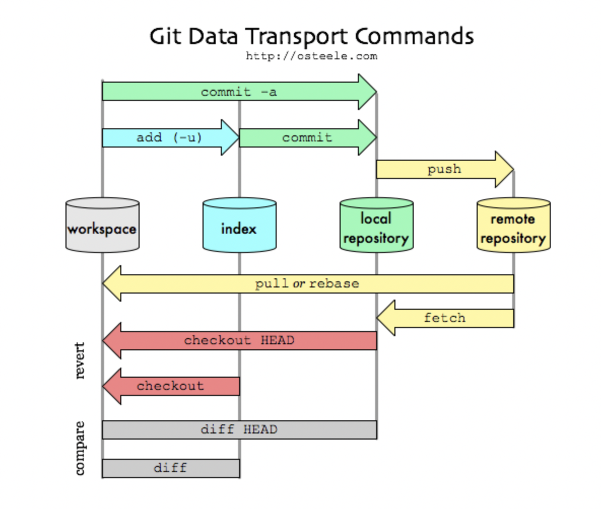

# Summer22 Project
This project displays a basic data management process 
with some data visualization and machine learning analysis.
From database design, to data transformation and calculation, 
to apply processed data into simple ML models, the weekly progress is presented 
in the following text. **Python**, **SQL** (PostgreSQL), and **Superset** are the languages and 
tools used in this project. 
## Week 1: Database startup
- Confirm data source: Cryptocurrency Kline from Binance
  ```
  vendor_source = {"binance": "https://api.binance.com/api/v3/klines"}
  ```
- Database design: get raw, staging, and target data ready
  - Raw data: see csv files
  - Staging data 
  - Target data 
## Week 2: Loading data using Python
- Script 1: [raw_csv.py](raw_csv.py)
  - Download data from source link through `requests.get`
  - Write into csv file named `[symbol]_[frequency]_[vendor].csv` for easy search
- Script 2: [staging_table.py](staging_table.py)
  - Get connection to PostgreSQL through package `psycopg2`
  - Functions to create a new Database and set up tables
  - `queryData()`function to retrieve id values from the "symbols" and "vendors" table
  - Read csv file as Dataframe, add columns, fill in values
  - Export the dataframe to PostgreSQL table "index and transaction", keeping 
  all raw data types
- Script 3: [target_table.py](target_table.py)
  - Create table for target data
  - Drop useless columns and transform to target data types
  - Export to PostgreSQL table
- Learn how to use **CLI** to run programs. [Reference](https://towardsdatascience.com/how-to-write-user-friendly-command-line-interfaces-in-python-cc3a6444af8e)
## Week 3: Superset Visualization
- Learn basic logic of **Git** and how to use. [Reference](https://medium.com/@chonglee30/git-overview-30618e81eb77) 
- [Adding a local repository to GitHub using Git](https://docs.github.com/en/get-started/importing-your-projects-to-github/importing-source-code-to-github/adding-locally-hosted-code-to-github#adding-a-local-repository-to-github-using-git)
- Superset setup and connection guide [Reference](https://superset.apache.org/docs/installation/installing-superset-using-docker-compose)
  1. Using Docker compose to install Superset: install Docker for Mac
  2. Clone Superset's GitHub repository 
  ```
  git clone https://github.com/apache/superset.git
  ```
  3. Launch Superset Through Docker Compose
  ```
  cd superset
  docker-compose -f docker-compose-non-dev.yml pull
  docker-compose -f docker-compose-non-dev.yml up
  ```
  4. Log in to Superset by open its website: http://localhost:8088
  5. Connecting Superset to PostgreSQL databases
     1. Click the “+” in the upper right corner → Data → Connect database → postgreSQL
     2. Required credentials: Host—host.docker.internal (Mac users) or 172.18.0.1 (Linux users), Port—5432, Database name, User name, Password, Display name → Click “Connect” 
     3. Or use the connection string:`postgresql://{username}:{password}@{host}:{port}/{database}`
  6. Upload tables to Superset
     1. Select “Data” → “Datasets” in the top
     2. “+ Dataset” in the upper right corner
     3. Choose the Database, Schema—public, and table
     4. Find the table uploaded, click the “Edit” sign, edit features of columns of the table
- Plot the charts: [Superset Dashboard](http://localhost:8088/superset/dashboard/p/6Ap3zpJvVQo/)
  - Charts are displayed in "kline_report.pdf"
- How to use unix timestamp to plot: dataset → edit the column → is temporal → DATETIME format: epoch_s/epoch_ms
## Week 4: Data Calculation
- Convert data into different time intervals with new corresponding index (open, high, low, volume, etc.)
  - By `for` loop → [interval_calculation_loop.py](interval_calculation_loop.py)
  - By `df.resample([interval]).agg()` → [interval_calculation_resample.py](interval_calculation_resample.py)
- Currency return and correlation of returns [return_correlation.py](return_correlation.py)
  - 1-day interval, 4-currency data loaded
  - Calculate daily and monthly returns; output stored in separate columns → "returns.csv"
  ```
  daily = df0['close'].pct_change()
  monthly = df0['close'].resample('M').ffill().pct_change()
  ```
  - Do the correlation; result is shown in "kline_report.pdf"
## Week 5: Data report and simple ML
- Write a pdf data report "kline_report.pdf" using package `FPDF`
  - Covers charts and correlation result
  - [writePDF_report.py](writePDF_report.py)
- Linear Regression test trading [BTC_linear_regression.py](BTC_linear_regression.py)
  - Load hourly data of BTCUSDT in 15 days
  - Calculate volume weighted average price(vwap) as the Y and create time dummy as X
  - Apply 7 days' data into linear regression model and make prediction for the next hour's price
  - If predicted price is higher than real vwap, buy a coin, otherwise, sell
  - Start with 0 coin and 0$ money, repeat this process for 7 days, clear all the coins at the end, and see whether profit or loss
  

  

 